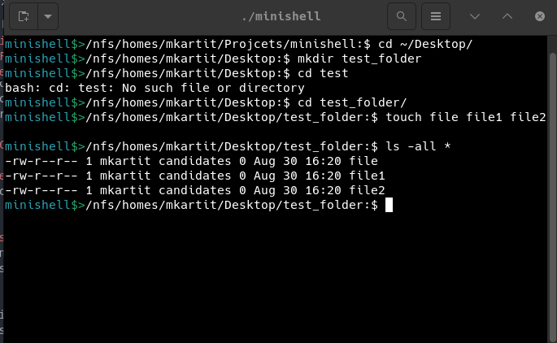
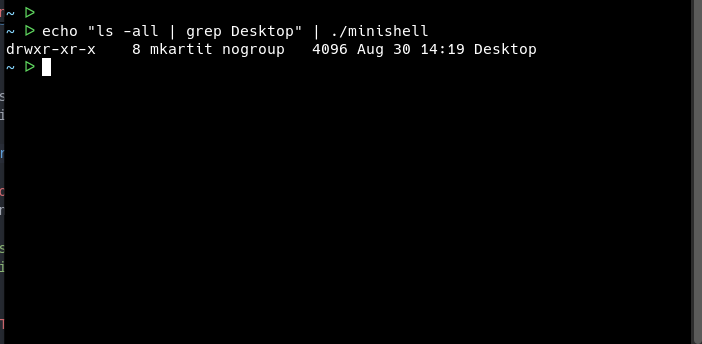

# 🐚 minishell


## 📘 Introduction

**minishell** stands out as one of the most challenging and rewarding projects in the 42 common core curriculum. This project pushes you to expand your knowledge across various domains of systems programming and shell implementation.

## 🌟 Features

Our minishell implementation includes both the mandatory and bonus features as outlined in the [subject](en.subject.pdf). We've utilized binary trees for efficient command parsing and execution.

### Built-in Commands
- `echo`: Display a line of text
- `cd`: Change the current directory
- `pwd`: Print working directory
- `export`: Set environment variables
- `env`: Display environment variables
- `unset`: Remove environment variables
- `exit`: Exit the shell
- `history`: Display command history (bonus feature)

### Shell Functionalities
- Simple command execution
- Pipes (`|`)
- Input/Output redirections (`<`, `>`, `>>`)
- Here documents (`<<`)
- Parentheses for precedence (bonus)
- Logical OR operator (`||`) (bonus)
- Logical AND operator (`&&`) (bonus)
- Wildcards (`*`) (bonus)
- Interactive and non-interactive modes

## 🚀 Getting Started

### Prerequisites
- GCC compiler
- Make

### Installation
1. Clone the repository:
   ```sh
   git clone https://github.com/MohamedKartit/minishell.git
   ```
2. Navigate to the project directory:
   ```sh
   cd minishell
   ```
3. Compile the project:
   ```sh
   make
   ```

### Usage

Our minishell supports both interactive and non-interactive modes:

#### Interactive Mode
Run the minishell:
```sh
./minishell
```
You'll see a prompt where you can enter commands:
```
./minishell$> ls
file file1 file2
```


#### Non-Interactive Mode
You can also use minishell to execute commands without entering the interactive prompt:
```sh
echo ls | ./minishell
file file1 file2
```

## 🧪 Testing

We've rigorously tested our minishell implementation to ensure robustness and compliance with the project requirements. Our test suite covers:

- Edge cases for each built-in command
- Complex command combinations using pipes and redirections
- Stress testing with deeply nested parentheses and multiple logical operators
- Wildcard expansion in various scenarios
- Both interactive and non-interactive modes of operation

## 🛠️ Implementation Details

Our minishell uses a binary tree structure for parsing and executing commands. This approach allows for efficient handling of complex command structures, especially when dealing with parentheses and logical operators.

Key components of our implementation:
1. Lexer: Tokenizes the input string
2. Parser: Builds the binary tree from tokens
3. Executor: Traverses the tree and executes commands
4. Built-in Command Handler: Manages the execution of built-in commands
5. Environment Variable Manager: Handles setting, unsetting, and displaying environment variables
6. Mode Handler: Manages the shell's behavior in interactive and non-interactive modes

## 👥 Contributors

- Mohamed Kartit: [Gihtub](https://github.com/MohamedKartit), [Twitter](https://x.com/mohamedkartit4)
- Abdessalam Gherghouch: [Github](https://github.com/DDOSooS), [Twitter](https://x.com/DDo__oS)

## 📜 License

This project is licensed under the MIT License - see the [LICENSE](LICENSE) file for details.

## 🙏 Acknowledgements

- 42 School for providing this challenging project
- Our peers and mentors for their support and code reviews

---

We hope you enjoy exploring our minishell implementation as much as we enjoyed creating it! Feel free to reach out with any questions or feedback.